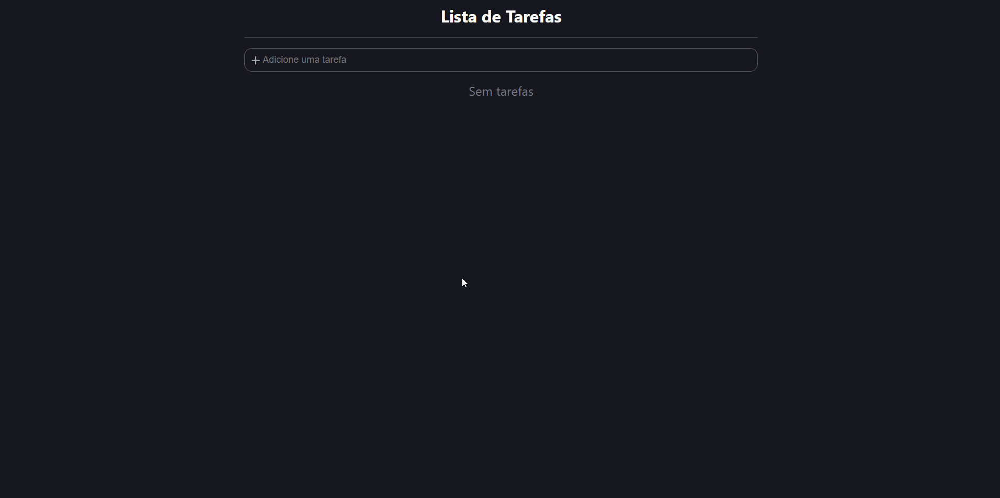

# ToDo-List 

<h4 align="center">
  🚧 Projeto ToDo-List e ReadMe 🚀 Em Construção 🚧
</h4>

## Sobre

Um aplicativo de gerenciamento de tarefas simples, o aplicativo foi baseado na aula "Lista de Tarefas" do [Bonieky Lacerda](https://www.youtube.com/watch?v=95sAtAareR8&t=3s), esse projeto teve como um primeiro contato a utilização de styled-components para a estilização e aprendizado de algumas ferramentas dentro do react.

### `Versão 01`

Nessa primeira versão temos a criação de novas tarefas e a possibilidade de assinalar se a tarefa foi concluída.

<h1 align="center">
  
</h1>

### `Itens que foram ou serão adicionados`

- [x] Usuário criar a tarefa
- [x] Usuário assinalar as tarefas concluídas
- [ ] Criar um banco de dados para salvar as tarefas
- [ ] Criar um botão para excluir as tarefas
- [ ] Criação de outros temas
- [ ] Criação da versão mobile

#

  Feito com 💜 por Lucas David 👋  
  Aproveitando que tal dar uma olhadinha no meu <a target="_blank" href="https://www.linkedin.com/in/lucasdav/">LinkedIn</a> 🌠

